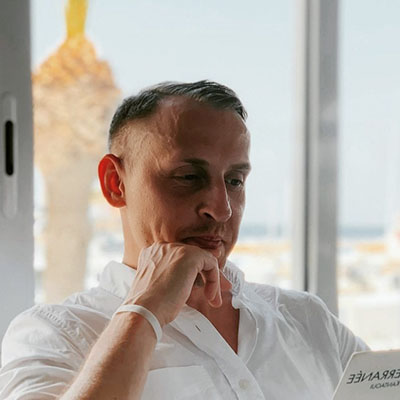

# Andrey Fedorov  


### Contacts
+ **Location**: Tbilisi, Georgia  
+ **E-mail**: ndru.dev@gmail.com  
+ **Github**: [@ndrutv](https://github.com/ndrutv)  

### About me
Hey! My name is Andrey, I live in Tbilisi (Georgia) and I'm studying to be a front-end developer. Here you'll find all information about my knowledge, skills and experience, as well as projects that I have already done.  

Now I'm looking for an internship to gain real experience in development or project-based remote work. Contact me if you're interested.  

### Skills
HTML • CSS • JavaScript • REACT • REDUX • SASS • Bootstrap • Figma • VSCode  

### Languages
+ **Russian**: Native  
+ **English**: A1  

### Code Example
```
const timer = document.querySelector('.timer');
let setTimeInSeconds = 130,
    intervalId = null;

let startCountDown = (sec, item) => {
    item.textContent = transformTime(sec);

    intervalId = setInterval(() => {
        if ( sec > 0 ) {
            sec--;
            item.textContent = transformTime(sec);
        } else {
            clearInterval(intervalId);
        }
    }, 1000);
};

let transformTime = (sec) => {
    let minutes = Math.floor(sec / 60);
    let seconds = sec % 60;

    return `${('0' + minutes).slice(-2)}:${('0' + seconds).slice(-2)}`;
};

startCountDown(setTimeInSeconds, timer);
```  

### Experience
+ 2009 - 2014 - SEO Specialist  
+ 2014 - 2018 - Contextual Advertising Specialist  
+ 2018 - 2021 - Targeted Advertising Specialist  

### Education
+ Saint-Petersburg Electrotechnical University «LETI».  
    Faculty of innovation management (2005 - 2008)
+ [freeCodeCamp: Responsive Web Design](https://www.freecodecamp.org/certification/ndru/responsive-web-design) (2022 - 2022)  
+ [Udemy: Полный курс по JavaScript + React](https://www.udemy.com/certificate/UC-ac72760e-3a10-44fc-ae69-1d02d998c6ba/) (2022 - 2023)
+ [RS School: JavaScript/Front-end. Stage 0](https://app.rs.school/certificate/91i6ehsc) (2022 - 2023)  