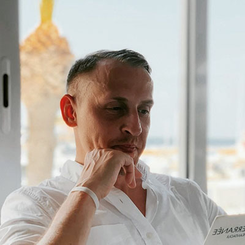

# Andrey Fedorov  


### Contacts
+ **Location**: Tbilisi, Georgia  
+ **E-mail**: ndru.dev@gmail.com  
+ **Github**: [@ndrutv](https://github.com/ndrutv)  

### About me
For more than 10 years I have worked in advertising and independently studied each of the areas: SEO, contextual and targeted advertising. I hope that the habit of self-study will help me in learning the profession of a front-end developer.  

I want to become a front-end developer, develop in this direction and reach new heights. I'm interested.  

### Skills
+ **HTML/CSS**:   --------&#124;------------ (40%)  
+ **JavaScript**: ----------&#124;---------- (50%)  
+ **React**:      --&#124;------------------ (10%)  

### Code Example
```
const timer = document.querySelector('.timer');
let setTimeInSeconds = 130,
    intervalId = null;

let startCountDown = (sec, item) => {
    item.textContent = transformTime(sec);

    intervalId = setInterval(() => {
        if ( sec > 0 ) {
            sec--;
            item.textContent = transformTime(sec);
        } else {
            clearInterval(intervalId);
        }
    }, 1000);
};

let transformTime = (sec) => {
    let minutes = Math.floor(sec / 60);
    let seconds = sec % 60;

    return `${('0' + minutes).slice(-2)}:${('0' + seconds).slice(-2)}`;
};

startCountDown(setTimeInSeconds, timer);
```  

### Experience
+ 2009 - 2014 - SEO Specialist  
+ 2014 - 2018 - Contextual Advertising Specialist  
+ 2018 - 2021 - Targeted Advertising Specialist  
+ ...  

### Education
+ Saint-Petersburg Electrotechnical University «LETI».  
    Faculty of innovation management (2005 - 2008)
+ [freeCodeCamp: Responsive Web Design](https://www.freecodecamp.org/certification/ndru/responsive-web-design) (2022 - 2022)  
+ [Udemy: Полный курс по JavaScript + React](https://www.udemy.com/course/javascript_full/) (2022 - ...)
+ [RS School: JavaScript/Front-end. Stage 0](https://rs.school/js-stage0/) (2022 - ...)  

### Languages
+ **Russian**: Native
+ **English**: A1